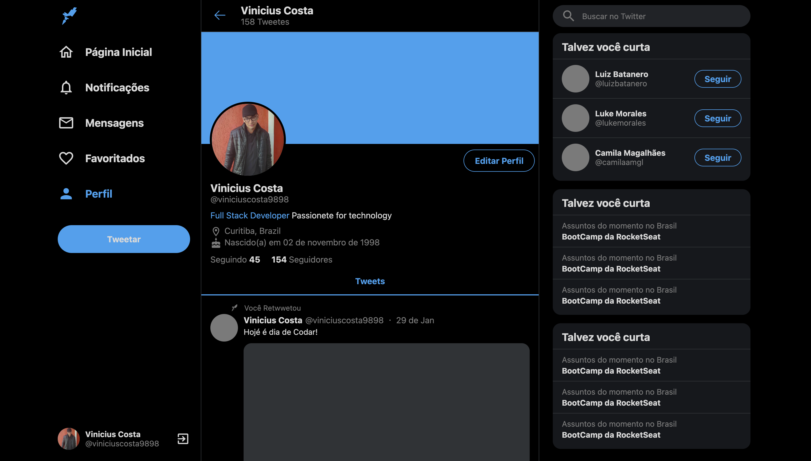

# Twitter UI Clone

# 📸 Overview:


# 💻 Project:
## Clone da Interface do Twitter

# 🚀 Technologies:
### ✔️ ReactJS 
### ✔️ TypeScript
### ✔️ Styled-Components
### ✔️ Vite

# How to run

```
# Clone this repository
$ git clone https://github.com/vinnycosta9898/twitter-ui-clone

# Go to the directory
$ cd twitter-ui-clone

# Install Dependencies
$ npm install

# Run Web Server
$ npm run dev